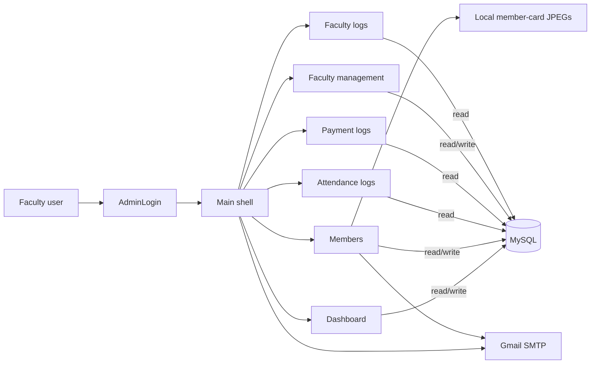
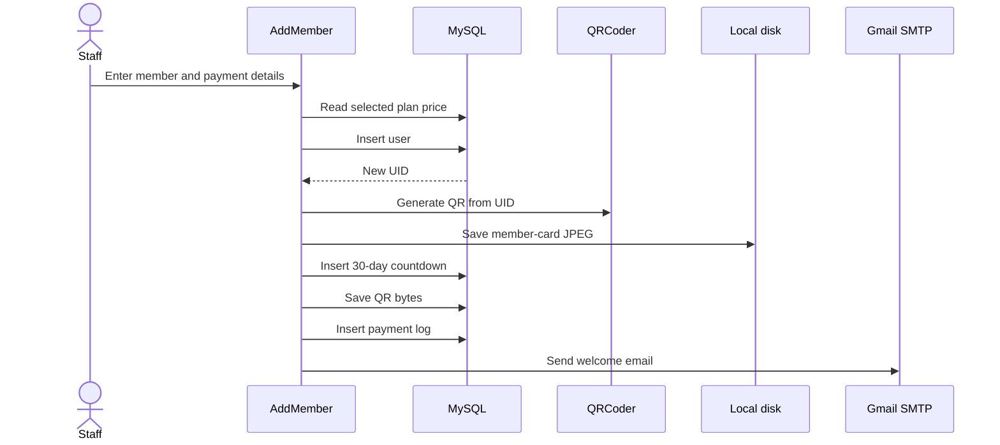
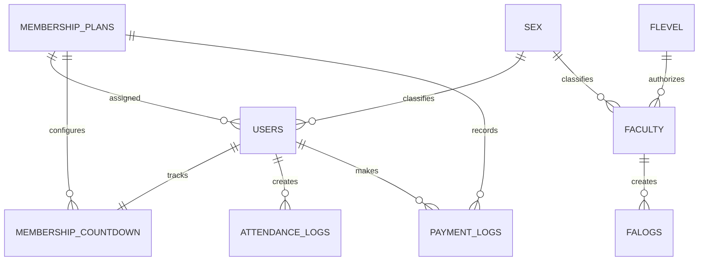

# Iron Lifters

Iron Lifters is a Windows desktop gym-management system written in Visual Basic .NET using Windows Forms. It manages gym members, faculty accounts, QR-code attendance, membership renewals, payment history, login/logout audit records, member cards, and email notifications.

The repository contains one Visual Studio solution and one application project. The application connects directly to a MySQL database; there is no API or separate backend service.

> [!IMPORTANT]
> This repository is a legacy snapshot and is not ready for production deployment without configuration and security work. It contains hard-coded database and SMTP credentials, machine-specific file paths, no database migration, and no automated tests. Read [Security and deployment blockers](#security-and-deployment-blockers) and [Known implementation issues](#known-implementation-issues) before running it with real data.

## Table of contents

- [System overview](#system-overview)
- [Features](#features)
- [Technology stack](#technology-stack)
- [Architecture](#architecture)
- [Application lifecycle](#application-lifecycle)
- [Screens and modules](#screens-and-modules)
- [Core workflows](#core-workflows)
- [Database contract](#database-contract)
- [Configuration](#configuration)
- [Prerequisites](#prerequisites)
- [Setup](#setup)
- [Build and run](#build-and-run)
- [Using the application](#using-the-application)
- [Project structure](#project-structure)
- [Security and deployment blockers](#security-and-deployment-blockers)
- [Known implementation issues](#known-implementation-issues)
- [Testing and validation](#testing-and-validation)
- [Recommended modernization path](#recommended-modernization-path)
- [Troubleshooting](#troubleshooting)
- [Repository status](#repository-status)

## System overview

The application is intended for front-desk or administrative use in a gym.

At startup, a faculty member signs in. After authentication, the main window hosts a set of WinForms `UserControl` screens:

- A dashboard for QR-based attendance and monthly attendance totals
- Member management
- Payment processing and payment history
- Attendance history
- Faculty management
- Faculty login/logout history

MySQL is the system of record. Images and generated QR codes are stored as binary data in the database, while generated membership-card JPEG files are written to a local folder.



## Features

### Authentication and authorization

- Authenticates faculty accounts against the `faculty` table.
- Stores the current faculty ID, access level, login time, logout time, and faculty-log ID in a global session module.
- Writes faculty login and logout times to `falogs`.
- Uses access level `2` as the super-admin level.
- Hides faculty management and faculty logs from non-super-admin accounts.

### Member management

- Lists all members with:
  - User ID
  - Full name
  - Sex
  - Active/disabled state
  - Username
  - Registration date
  - Membership plan
  - Remaining membership days
- Searches across all displayed columns.
- Supports multi-select through checkboxes.
- Disables selected members.
- Registers new members.
- Uploads and stores profile images.
- Creates and stores a QR code containing the member's numeric user ID.
- Creates a printable membership-card image.
- Adds membership plans.

### Attendance

- Accepts input from a QR scanner through a focused text box.
- Treats an Enter key after scanner input as the end of a scan.
- Rejects disabled members.
- Creates an `In` record on the first scan.
- Adds `Out` time on the next scan for an open attendance record.
- Creates another visit when the latest visit already has both `In` and `Out`.
- Shows today's attendance records.
- Shows a bar chart of daily attendance counts for the current month.
- Displays the scanned member's name and profile image.
- Provides date-filtered attendance history.

### Membership countdown and renewal

- Stores remaining membership time in `membership countdown.days_left`.
- On main-window startup, compares the current date with the local `LastCheckedDate` application setting.
- Decreases all membership countdowns by the number of elapsed days.
- Prevents countdown values from going below zero.
- Disables users whose countdown reaches zero.
- Finds memberships with three or fewer days remaining.
- Sends renewal or expiration emails.
- Marks notifications as sent to avoid repeated email.
- Adds 30 days when a payment is confirmed.

### Payments

- Shows all members and their current plan price in a payment-processing dialog.
- Reactivates disabled members after payment.
- Adds 30 membership days.
- Writes a record to `payment logs`.
- Sends an invoice email.
- Provides date-filtered, searchable payment history.
- Formats displayed amounts using the Philippine peso symbol.

### Faculty administration

- Lists faculty details and access levels.
- Searches faculty records.
- Adds faculty accounts.
- Deletes selected faculty accounts.
- Prevents the currently signed-in faculty account from deleting itself.
- Provides date-filtered faculty login/logout audit records.

### UI behavior

- Collapsible animated sidebar.
- Owner-drawn list views with alternating row colors.
- Shared column-resizing logic.
- Auto-closing success and error dialogs for attendance and member creation.
- Embedded navigation artwork and icons.

## Technology stack

| Area | Technology |
|---|---|
| Language | Visual Basic .NET |
| UI | Windows Forms |
| Runtime target | .NET Framework 4.8.1 |
| IDE/solution | Visual Studio 2022 solution format |
| Database | MySQL |
| Database provider | MySQL Connector/NET (`MySql.Data`, referenced as 8.0.30) |
| QR generation | QRCoder 1.6.0 |
| Charts | `System.Windows.Forms.DataVisualization` |
| Email | `System.Net.Mail` with Gmail SMTP |
| Image processing | `System.Drawing` |
| Local settings | VB `My.Settings` |

The project also references QuestPDF through an absolute path, but no application source uses QuestPDF. See [Dependency problems](#dependency-problems).

## Architecture

This is a stateful, single-process desktop application. There are no formal service, repository, or domain layers.

### Presentation layer

Windows Forms and user controls contain UI logic, validation, database queries, and workflow orchestration.

- Forms are used for login, the main shell, creation dialogs, payment processing, and timed messages.
- User controls are loaded into the main shell for dashboard and management screens.
- Designer files define controls and layout.
- `.resx` files contain serialized WinForms resources.

### Shared modules

`GlobalModule.vb` provides:

- A single global `MySqlConnection`
- Connection open/close helpers
- A shared `ImageList`
- Member-card image generation and file output
- Shared list-view drawing/resizing helpers

`AdminLoggedModule.vb` provides in-memory session state for the signed-in faculty user.

`InvoiceModule.vb` sends welcome, renewal, expiration, and invoice emails.

### Data access

Each screen issues SQL directly through `MySqlCommand`. Most database operations are synchronous and run on the UI thread.

The application uses a mixture of parameterized SQL and concatenated SQL. No ORM, migration framework, or schema-versioning system is present.

### State

The application has three kinds of state:

1. MySQL data, including users, membership status, attendance, payments, and faculty logs.
2. Process-global state in `GlobalModule` and `AdminLoggedModule`.
3. Per-Windows-user settings, currently only `LastCheckedDate`.

## Application lifecycle

1. `Iron_Lifters.My.MyApplication` starts `AdminLogin`.
2. A faculty username and password are checked against MySQL.
3. On success:
   - Session values are populated.
   - A `falogs` row is inserted.
   - The generated faculty-log ID is retained for logout.
   - The application main form changes to `Main`.
4. `Main` loads:
   - Access-level restrictions
   - The dashboard
   - The collapsed/expanded sidebar state
   - Membership countdown updates
   - Renewal-email checks
5. Navigation replaces the content of the `fragment` panel with a new user-control instance.
6. Logout updates the current `falogs.out_datetime`, switches the main form back to `AdminLogin`, and closes `Main`.

## Screens and modules

### `AdminLogin`

Purpose: faculty authentication.

Behavior:

- Reads `uBox` and `pBox`.
- Queries `faculty` for an exact username/password match.
- Stores `FID` and `FIDLevel`.
- Inserts a login record into `falogs`.
- Opens `Main`.
- Displays an unauthorized-login message when no row matches.

### `Main`

Purpose: application shell and cross-cutting startup logic.

Responsibilities:

- Sidebar animation and navigation
- Dynamic loading of user controls
- Access-level checks
- Membership-day decrement
- Member disabling at zero days
- Renewal-email dispatch
- Faculty logout logging

### `Dashboard`

Purpose: current attendance operations and summary.

Components:

- Current-month attendance bar chart
- Today's attendance list
- Search field
- Scanner input field
- Last-scanned attendance ID
- Last-scanned member name
- Last-scanned profile image

Attendance state machine:

| Existing record today | `In` | `Out` | Scan result |
|---|---:|---:|---|
| No | — | — | Insert a new record with current `In` time |
| Yes | Set | Empty | Update that record with current `Out` time |
| Yes | Set | Set | Insert a new visit with current `In` time |

The user's `status` must be `1`; otherwise attendance is rejected.

### `Members`

Purpose: member lookup and lifecycle management.

Actions:

- Refresh member data
- Search displayed data
- Select one or many members
- Select/deselect all
- Disable members
- Open member registration
- Open payment processing
- Add a membership plan
- Generate membership-card JPEGs from stored QR images

### `AddMember`

Purpose: register and initialize a member.

Required input:

- Last name
- First name
- Sex
- Email
- Username
- Password
- Phone number
- Membership plan
- Profile image
- Checked active-status box

Creation sequence:

1. Validate fields.
2. Read the selected plan price.
3. Prompt for payment amount.
4. Insert the `users` row.
5. Obtain the generated `UID`.
6. Generate a QR code containing only the `UID`.
7. Save a local membership-card JPEG.
8. Insert a 30-day membership countdown.
9. Store the QR PNG in `users.qr`.
10. Insert an initial payment log.
11. Send a welcome/payment email.

The entered payment amount is validated but is not stored in the database; payment history derives amount from the current membership-plan price.

### `PaymentProcess`

Purpose: process one or more renewals.

For each checked member:

1. Resolve the membership plan ID by plan name.
2. Reactivate the user when disabled.
3. Add 30 days to the countdown.
4. Reset an email-notification flag.
5. Insert a payment-log row.
6. Replace `users.created_at` with the current timestamp.
7. Send an invoice email using the displayed plan price.

### `PaymentLogs`

Purpose: read-only payment history.

- Defaults to the selected date in `DateTimePicker1`.
- Joins payment logs, users, and membership plans.
- Searches all displayed columns.

### `AttendanceLogs`

Purpose: historical member attendance.

- Filters records by selected date.
- Displays member identity, in/out times, date, and remaining membership days.
- Searches all displayed columns.

### `FacultyManagement`

Purpose: super-admin faculty account management.

- Lists faculty identity, contact information, registration date, and access level.
- Adds faculty through `AddFaculty`.
- Deletes checked faculty accounts.
- Blocks self-deletion.

### `AddFaculty`

Purpose: create a faculty account.

- Loads account levels from `flevel`.
- Loads sex options from `sex`.
- Inserts a faculty record.

The current implementation does not perform complete input validation and constructs its insert query through string concatenation.

### `FacultyLogs`

Purpose: super-admin audit history.

- Filters faculty login records by date.
- Displays faculty name, sex, username, login time, and logout time.
- Searches all displayed columns.

### `AddMembershipPlan`

Purpose: create a plan.

- Requires a plan name and positive decimal price.
- Requests confirmation.
- Inserts into `membership plans`.

There is no duration field. All plans currently receive 30 days in application logic.

### `AutoCloseMessageBox`

Purpose: small modal status window that closes itself after a supplied number of milliseconds.

### `GlobalModule`

Purpose: global database, image, card, and list-view utilities.

### `AdminLoggedModule`

Purpose: process-local faculty session values.

### `InvoiceModule`

Purpose: Gmail SMTP integration for:

- Registration/welcome email
- Payment invoice
- Renewal warning
- Expiration warning

## Core workflows

### Registering a member



### Scanning attendance

1. A keyboard-emulating scanner writes the member UID into `txtScannerInput`.
2. The scanner sends Enter.
3. The dashboard queries today's latest attendance row and the member status.
4. Disabled users are rejected.
5. Active users are checked in, checked out, or assigned a new visit.
6. Today's table and current-month chart are refreshed.

### Daily membership update

1. `Main` reads `My.Settings.LastCheckedDate`.
2. If it is earlier than today, the elapsed day count is calculated.
3. Every `membership countdown.days_left` value is reduced by that count, with a floor of zero.
4. Users at zero days are disabled.
5. The local setting is updated to today.
6. Members at three days or fewer with an unsent flag receive an email.

This logic only runs when the main window loads; there is no background service or scheduled database job.

## Database contract

No `.sql` file, migration, or database backup is included. The following contract is inferred from every query in the source. Exact MySQL types, indexes, constraints, and defaults must be recreated or obtained from the original database.

The configured database name is `gym management system`.

### Relationship overview



### `users`

Member master table.

| Column | Inferred purpose |
|---|---|
| `UID` | Integer primary key, auto-increment |
| `created_at` | Registration timestamp; expected to default to current timestamp |
| `lastname` | Member last name |
| `firstname` | Member first name |
| `sex` | Foreign key-like value to `sex.SID` |
| `email` | Recipient for welcome, renewal, and invoice emails |
| `uname` | Member username |
| `pword` | Member password, currently stored as plain text |
| `status` | `1` active, `0` disabled |
| `MPID` | Membership plan reference |
| `image` | Profile-image binary data |
| `phone_no` | Phone number |
| `qr` | QR-code PNG binary data |

### `membership plans`

Plan catalog. The table name contains a space and is always escaped with backticks.

| Column | Inferred purpose |
|---|---|
| `MPID` | Integer primary key, auto-increment |
| `membership_plan_name` | Display name; payment processing expects it to resolve to one plan |
| `price` | Decimal plan price |

There is no plan-duration column. Registration and renewal both hard-code 30 days.

### `membership countdown`

One membership-state row is expected per member.

| Column | Inferred purpose |
|---|---|
| `MCID` | Integer primary key, referenced only for member listing |
| `UID` | Member reference; should be unique |
| `MPID` | Plan reference |
| `days_left` | Non-negative remaining days |
| `emails_sent` | Renewal-email sent flag used by `Main` |
| `email_sent` | Different singular spelling used by `PaymentProcess` |

The code uses both `emails_sent` and `email_sent`. Unless both columns exist, one of the renewal flows will fail. Standardize this before deployment.

### `attendance logs`

Member visit records. The table name contains a space.

| Column | Inferred purpose |
|---|---|
| `AID` | Integer primary key, auto-increment |
| `UID` | Member reference |
| `In` | Check-in time; reserved-looking name requiring backticks |
| `Out` | Nullable check-out time |
| `Date` | Attendance date; must default to the current date because inserts omit it |

Multiple visits per user per date are supported.

### `payment logs`

Payment event records. The table name contains a space.

| Column | Inferred purpose |
|---|---|
| `PID` | Integer primary key, auto-increment |
| `UID` | Member reference |
| `MPID` | Plan reference |
| `date_time_payed` | Payment timestamp; must default to current timestamp when omitted |

The misspelled column name `date_time_payed` is part of the current application contract.

### `faculty`

Administrative/staff accounts.

| Column | Inferred purpose |
|---|---|
| `FID` | Integer primary key, auto-increment |
| `created_at` | Creation timestamp; expected to default to current timestamp |
| `lastname` | Faculty last name |
| `firstname` | Faculty first name |
| `sex` | Reference to `sex.SID` |
| `email` | Faculty email |
| `username` | Login username |
| `password` | Login password, currently stored and compared as plain text |
| `FIDLevel` | Reference to `flevel.FIDLevel`; value `2` is treated as super admin |
| `phone_number` | Phone number |

### `flevel`

Faculty access-level lookup.

| Column | Inferred purpose |
|---|---|
| `FIDLevel` | Access-level ID |
| `level_name` | Human-readable level |

At minimum, the data must include a normal administrative level and a level with ID `2` for super admins.

### `sex`

Sex lookup table.

| Column | Inferred purpose |
|---|---|
| `SID` | Lookup ID |
| `Sex Name` | Human-readable value; column name contains a space |

Some displays assume ID `1` means male and every other value means female.

### `falogs`

Faculty authentication audit log.

| Column | Inferred purpose |
|---|---|
| `FALID` | Integer primary key, auto-increment |
| `FID` | Faculty reference |
| `in_datetime` | Login timestamp |
| `out_datetime` | Nullable logout timestamp |

### Recommended database constraints

These are not represented in the repository but should be added:

- Unique index on `users.uname`
- Unique index on `faculty.username`
- Unique index on `membership countdown.UID`
- Unique index on `membership plans.membership_plan_name`
- Foreign keys for every relationship shown above
- `CHECK (status IN (0, 1))`
- `CHECK (days_left >= 0)`
- Non-null constraints for required identity and relationship fields
- Indexes on attendance date, payment date, faculty login date, and all foreign-key columns
- Appropriate cascade/restrict behavior, especially before deleting faculty or plans

## Configuration

The application does not currently use environment variables or an external secrets provider.

### Database connection

Location: `Iron Lifters/GlobalModule.vb`

The connection string is constructed in source and targets:

- Server: local MySQL
- Database: `gym management system`
- User: a MySQL account
- Password: embedded in source

Replace this with a connection string from `App.config`, environment variables, Windows Credential Manager, or another secret store before use.

An appropriate configuration shape would be:

```xml
<connectionStrings>
  <add
    name="GymDatabase"
    providerName="MySql.Data.MySqlClient"
    connectionString="Server=localhost;Database=gym management system;User ID=YOUR_USER;Password=YOUR_PASSWORD;" />
</connectionStrings>
```

The application code must then read the named connection string instead of using its hard-coded value.

### SMTP

Location: `Iron Lifters/InvoiceModule.vb`

Current behavior:

- Server: Gmail SMTP
- Port: `587`
- TLS/SSL enabled
- Sender account and app password embedded in source

Use a dedicated sender account and load its credentials from protected configuration. Gmail accounts generally require an app password when two-factor authentication is enabled.

### Member-card output

Location: `Iron Lifters/GlobalModule.vb`

The output directory is currently hard-coded to:

```text
E:\Iron Lifters Cards
```

The directory is created automatically when possible. Change it to a configurable, writable folder that exists on the target Windows machine.

Card format:

- JPEG
- 400 × 200 pixels
- QR image at the left
- Member full name and UID at the right
- Filename: `Card_<UID>.jpeg`

### Status icons

`InitializeImageList` loads active and disabled icons from absolute paths under a previous developer's Windows profile. Those files are not present at those paths on another machine.

Use embedded resources from `Iron Lifters/Resources` or copy the required icons to a known application directory and update the code.

### Local application setting

`App.config` and `My Project/Settings.settings` define:

| Setting | Type | Scope | Purpose |
|---|---|---|---|
| `LastCheckedDate` | Date/time | User | Last date on which membership days were decremented |

Because this is a per-Windows-user setting, running the program under a different account creates an independent countdown checkpoint.

## Prerequisites

Use Windows for development and runtime.

- Windows 10 or Windows 11
- Visual Studio 2022
- Visual Basic desktop development support
- .NET Framework 4.8.1 Developer Pack/Targeting Pack
- MySQL Server
- MySQL Connector/NET compatible with the project reference, currently 8.0.30
- NuGet package restore support
- A writable card-output directory
- Network access to Gmail SMTP if email features are enabled
- A QR scanner that acts as a keyboard and sends Enter after each scan, or manual UID entry for testing

The project is not a modern cross-platform .NET application. It cannot be expected to build or run on Linux/macOS because it targets classic .NET Framework WinForms.

## Setup

### 1. Clone and open the solution

```powershell
git clone <repository-url>
cd Iron-Lifters
start "Iron Lifters.sln"
```

### 2. Install Visual Studio components

In Visual Studio Installer, ensure the .NET desktop development workload and .NET Framework 4.8.1 targeting pack are installed.

### 3. Restore packages

The repository uses legacy `packages.config` restore for QRCoder:

```powershell
nuget restore "Iron Lifters.sln"
```

Visual Studio can also restore packages automatically when the solution opens.

### 4. Resolve assembly references

Confirm these references are available:

- `MySql.Data`
- `MySql.Data.EntityFramework`
- `MySql.Web`
- `QRCoder`

The MySQL packages are referenced by assembly identity but are not listed in `packages.config`. If Visual Studio reports missing references, install MySQL Connector/NET 8.0.30 or convert the references to NuGet `PackageReference` entries.

Remove the unused QuestPDF reference or replace its absolute `HintPath` with a restored package reference.

### 5. Create the MySQL database

Create a database named:

```sql
CREATE DATABASE `gym management system`;
```

Create the tables and columns described in [Database contract](#database-contract). Since no canonical schema is checked in, verify types/defaults against all source queries before entering real data.

Required defaults include:

- `users.created_at`: current timestamp
- `faculty.created_at`: current timestamp
- `attendance logs.Date`: current date
- `payment logs.date_time_payed`: current timestamp
- Email notification flag: `0`

Seed:

- Sex lookup rows
- Faculty access-level rows
- At least one faculty account with `FIDLevel = 2`
- At least one membership plan

### 6. Move secrets out of source

Before the first real run:

- Rotate the database password currently exposed in Git history.
- Rotate the Gmail app password currently exposed in Git history.
- Put new credentials in protected configuration.
- Remove credentials from source.

### 7. Fix local paths

Update:

- Member-card output directory
- Active status icon path
- Disabled status icon path
- QuestPDF reference, preferably by removing it

### 8. Initialize `LastCheckedDate`

Set the value to the current date before first use against populated membership data. Otherwise, an uninitialized or old date can produce a large elapsed-day calculation and reduce every membership to zero.

## Build and run

### Visual Studio

1. Open `Iron Lifters.sln`.
2. Select a build configuration.
3. Restore packages and resolve missing references.
4. Build the solution.
5. Press F5.

`AdminLogin` is the generated startup form.

### MSBuild

From a Visual Studio Developer PowerShell:

```powershell
msbuild "Iron Lifters.sln" /t:Restore,Build /p:Configuration=Release /p:Platform="Any CPU"
```

Expected output:

```text
Iron Lifters\bin\Release\Iron Lifters.exe
```

### Platform configurations

| Configuration | Platform target |
|---|---|
| Debug / Any CPU | ARM64 |
| Release / Any CPU | AnyCPU |
| Debug / x64 | x64 |
| Release / x64 | x64 |

The `Debug / Any CPU` configuration unexpectedly targets ARM64. On a normal x64 development machine, choose `Debug / x64` or correct the project configuration.

## Using the application

### First login

Use the super-admin faculty account seeded in the database. Successful login creates a `falogs` row.

### Add a membership plan

1. Open Members.
2. Select the plan action.
3. Enter a unique name and positive price.
4. Confirm.

All plans currently have a hard-coded 30-day duration.

### Register a member

1. Open Members.
2. Select Add Member.
3. Fill every field.
4. Upload a profile image.
5. Select sex and membership plan.
6. Check the active-status box.
7. Confirm.
8. Enter a payment amount at least equal to the plan price.

The application writes the member, countdown, QR code, and payment log, then generates a card and sends email.

### Record attendance

1. Open Dashboard.
2. Scan the member's generated QR code.
3. The scanner must send Enter.
4. Scan again to check out.
5. Scan after checkout to begin a new visit.

For manual testing, type a numeric `UID` into the scanner field and press Enter.

### Renew membership

1. Open Members.
2. Open payment processing.
3. Check one or more users.
4. Confirm.

Each selected user receives 30 additional days, a payment-log row, reactivation if needed, and an invoice email.

### Review logs

Attendance, payment, and faculty logs each:

- Default to a selected date
- Reload when the date changes
- Support text search across displayed rows

## Project structure

```text
Iron-Lifters/
├── .gitattributes
├── .gitignore
├── Iron Lifters.sln
└── Iron Lifters/
    ├── Iron Lifters.vbproj
    ├── App.config
    ├── packages.config
    ├── GlobalModule.vb
    ├── AdminLoggedModule.vb
    ├── InvoiceModule.vb
    ├── AdminLogin.vb
    ├── Main.vb
    ├── Dashboard.vb
    ├── Members.vb
    ├── AddMember.vb
    ├── AddMembershipPlan.vb
    ├── PaymentProcess.vb
    ├── PaymentLogs.vb
    ├── AttendanceLogs.vb
    ├── FacultyManagement.vb
    ├── AddFaculty.vb
    ├── FacultyLogs.vb
    ├── AutoCloseMessageBox.vb
    ├── *.Designer.vb
    ├── *.resx
    ├── My Project/
    │   ├── Application.myapp
    │   ├── Application.Designer.vb
    │   ├── AssemblyInfo.vb
    │   ├── Resources.resx
    │   ├── Resources.Designer.vb
    │   ├── Settings.settings
    │   └── Settings.Designer.vb
    └── Resources/
        └── UI images and icons
```

### File map

| File | Role |
|---|---|
| `Iron Lifters.sln` | Visual Studio solution |
| `Iron Lifters.vbproj` | Build configuration, source list, references, resources |
| `App.config` | Runtime target and local user settings |
| `packages.config` | Legacy NuGet declaration for QRCoder |
| `GlobalModule.vb` | Database connection, image list, cards, shared UI helpers |
| `AdminLoggedModule.vb` | Current faculty session state |
| `InvoiceModule.vb` | SMTP email implementation |
| `AdminLogin.vb` | Authentication and login audit |
| `Main.vb` | Main shell, navigation, countdown, renewal notifications, logout |
| `Dashboard.vb` | QR attendance and attendance chart |
| `Members.vb` | Member list and member actions |
| `AddMember.vb` | Member registration |
| `PaymentProcess.vb` | Membership renewal |
| `PaymentLogs.vb` | Payment-history view |
| `AttendanceLogs.vb` | Attendance-history view |
| `FacultyManagement.vb` | Faculty list/add/delete |
| `AddFaculty.vb` | Faculty creation |
| `FacultyLogs.vb` | Faculty login/logout history |
| `AddMembershipPlan.vb` | Plan creation |
| `AutoCloseMessageBox.vb` | Timed modal message |
| `*.Designer.vb` | Generated control initialization and layout |
| `*.resx` | Form and control resources |
| `My Project/*` | Generated VB application, settings, assembly, and resource metadata |
| `Resources/*` | Logos and navigation icons |

## Security and deployment blockers

These items should be treated as blockers for use with real users.

### Exposed secrets

Database and Gmail credentials are committed directly in source. Assume they are compromised:

1. Rotate both credentials.
2. Remove them from source.
3. Consider purging secrets from Git history.
4. Use least-privilege database and email accounts.

### Plain-text passwords

Both member and faculty passwords are stored as plain text. Faculty login performs an exact plain-text comparison.

Use a modern password hash such as Argon2id, bcrypt, or PBKDF2 with an individual salt. Never decrypt passwords for comparison.

### SQL injection

Several commands concatenate values into SQL, notably faculty creation and some date/status operations. `AddFaculty` accepts directly concatenated user input.

Parameterize every query.

### Excessive database privilege

The current connection uses a root-style database account. Create an application-specific MySQL user with only the required CRUD privileges.

### Personal data

The database stores names, email addresses, phone numbers, profile images, attendance behavior, and payment records. Apply appropriate retention, access control, backups, and privacy requirements.

### Email privacy and reliability

Email is sent synchronously on the UI thread. Failures are shown through message boxes. There is no retry queue, delivery audit, rate limiting, or separation between transactional operations and notifications.

### No transaction around multi-step member/payment workflows

Member registration and payment renewal perform multiple writes without a transaction. Partial failures can leave inconsistent records.

Wrap each workflow in a database transaction and send email only after commit.

## Known implementation issues

### Dependency problems

- QuestPDF uses an absolute path under a previous developer's Downloads directory.
- QuestPDF is not used and should be removed.
- MySQL assemblies are referenced without NuGet package entries or portable hint paths.
- Only QRCoder appears in `packages.config`.
- Several unused WPF imports/references are present.

### Machine-specific paths

- Status icons load from a previous developer's desktop.
- Cards save to a fixed `E:` drive.
- The status icon resources referenced by code do not match the portable project resources.

These paths will cause runtime failures on a clean machine.

### First-run countdown risk

`LastCheckedDate` can be empty or very old. The first main-window load may calculate a very large elapsed-day count and set all memberships to zero.

Initialize the setting safely and move countdown calculation to a server-side, per-member expiration date.

### Notification-column mismatch

`Main` reads/writes `emails_sent`, while `PaymentProcess` resets `email_sent`. This is likely a runtime SQL error or a failure to re-enable renewal notifications.

### Global connection disposal

`Dashboard.ProcessAttendance` wraps the shared global connection in `Using conn`, which disposes it after the first attendance operation. Later operations may fail when attempting to reuse the disposed object.

Use a new local connection per operation instead of a global connection.

### Sex and plan ID mapping

- `AddMember` and `AddFaculty` derive database IDs from combo-box indexes.
- Member sex uses `SelectedIndex` without adding one.
- Membership and access-level IDs assume rows are contiguous and returned in the expected order.
- Some displays hard-code sex ID `1` as male and all others as female.

Bind combo boxes to explicit ID/value pairs.

### Renewal semantics

- Every plan receives exactly 30 days.
- Renewal adds 30 days regardless of selected plan.
- Renewal changes `users.created_at`, destroying the original registration date.
- The member's `MPID` and countdown `MPID` are not changed during renewal.
- Payment amount is inferred from current plan price rather than recorded as an immutable amount.

### Attendance details

- A scan for a nonexistent UID leaves `userStatus` at `0` and reports the user as disabled instead of not found.
- The UI may show attendance ID `0` immediately after a newly inserted check-in because the generated ID is not read back.
- Queries and writes are synchronous on the UI thread.
- No scanner-input format validation limits the UID to a valid integer.

### Member creation

- Active status must be checked; creating an initially disabled member is effectively blocked by validation.
- Email format and uniqueness are not validated.
- Username uniqueness is not checked in application code.
- Phone validation only checks non-empty and length.
- Payment input is not persisted.
- Generated cards are saved before all database writes complete.
- Failure after user insertion can leave a partially created member.

### Faculty management

- `AddFaculty` parses phone number as an integer, losing leading zeros and rejecting common formatting.
- `AddFaculty` lacks required-field and email validation.
- The attempted last-super-admin protection checks the sex column for the text `Super Admin`, so it does not work.
- A super-admin count is queried but never enforced.
- Deleting faculty may conflict with existing `falogs` foreign keys.

### List and UI behavior

- `InitializeImageList` adds images to one global list repeatedly, which can duplicate keys/images.
- Dashboard captures its search snapshot before list-view columns are configured and does not consistently refresh the snapshot after attendance updates.
- Shared list resizing assumes at least two columns.
- Database and SMTP calls can freeze the interface.
- Error handling primarily consists of message boxes; there is no structured logging.

### Data model limitations

- Remaining membership is modeled as a mutable counter rather than an expiration date.
- Plan duration is not modeled.
- Payment amount is not modeled on the payment row.
- There is no payment reference, method, status, cashier, or immutable price snapshot.
- Table and column names contain spaces and reserved-looking words.
- No migrations or schema version exist.

## Testing and validation

There are no unit, integration, UI, or database tests in the repository.

This README was produced through static inspection. The project was not built in the current environment because it is a Windows-only .NET Framework WinForms application and the available environment does not contain Visual Studio/MSBuild or a compatible .NET Framework toolchain.

### Minimum manual smoke test

Use a disposable database and test SMTP account.

1. Build Release / Any CPU or Debug / x64.
2. Verify a super-admin can sign in.
3. Verify `falogs.in_datetime` is written.
4. Add a plan.
5. Add a member with an image.
6. Verify user, countdown, QR, card, payment log, and welcome email.
7. Scan the member UID:
   - First scan creates `In`.
   - Second scan creates `Out`.
   - Third scan creates another visit.
8. Disable the member and verify scanning is rejected.
9. Process renewal and verify:
   - User reactivation
   - 30-day increment
   - Notification flag reset
   - Payment log
   - Invoice email
10. Change dates in every log screen.
11. Verify normal admins cannot see faculty management/logs.
12. Verify logout writes `falogs.out_datetime`.
13. Restart on the same date and confirm membership days are not decremented twice.
14. Simulate a one-day date change and confirm exactly one day is removed.

### Tests to add

- Password hashing and authentication
- Membership expiration calculations
- Attendance state transitions
- New member transaction rollback
- Renewal transaction rollback
- Access-level enforcement
- Last-super-admin deletion protection
- Notification deduplication
- Email failure handling
- Repository integration tests against a temporary MySQL database

## Recommended modernization path

Suggested order:

1. Rotate and remove all committed secrets.
2. Add a canonical SQL migration and seed script.
3. Replace global connection usage with short-lived local connections.
4. Parameterize all SQL.
5. Hash passwords.
6. Remove absolute paths and embed status icons.
7. Remove QuestPDF and unused references.
8. Fix the notification-column mismatch.
9. Make member registration and renewal transactional.
10. Replace `days_left` with an expiration date.
11. Add plan duration and immutable payment amount fields.
12. Separate data access and business logic from WinForms controls.
13. Add automated tests.
14. Move email to a queued or retryable service.
15. Consider migrating to SDK-style .NET and a supported Windows desktop target.

## Troubleshooting

### Missing QuestPDF reference

Remove the reference from the project. No current source file uses it.

### Missing MySQL assemblies

Install MySQL Connector/NET 8.0.30 or add a supported `MySql.Data` NuGet package and update the project references.

### Missing QRCoder

Restore NuGet packages:

```powershell
nuget restore "Iron Lifters.sln"
```

### Application fails when opening Members or Payment Process

The active/disabled status icon paths do not exist. Update `InitializeImageList` to use embedded project resources.

### Card generation fails

The `E:\Iron Lifters Cards` path may not exist or be writable. Configure another directory.

### Email fails

Check:

- Network access to `smtp.gmail.com:587`
- TLS support
- Sender account status
- App-password validity
- Recipient email validity

Do not reuse the credentials committed in the repository.

### All members become disabled

Inspect `LastCheckedDate` and `membership countdown.days_left`. An invalid first-run date can cause a large decrement.

### Renewal notification SQL error

Standardize `email_sent` versus `emails_sent` in the database and source.

### Attendance works once and then database calls fail

Remove `Using conn` around the shared global connection in `Dashboard.ProcessAttendance`, or preferably refactor all operations to create and dispose their own connections.

### Login succeeds but faculty screens are hidden

The signed-in faculty row must have `FIDLevel = 2`.

### Debug build targets the wrong CPU

The Debug / Any CPU project configuration targets ARM64. Select Debug / x64 or update `PlatformTarget`.

## Repository status

- Initial project commit: December 9, 2024
- Assembly version: `1.0.0.0`
- Target framework: .NET Framework 4.8.1
- Automated tests: none
- Database schema/migrations: not included
- License: not included

Without a license file, normal copyright restrictions apply. Add an explicit license before distributing or accepting external contributions.
